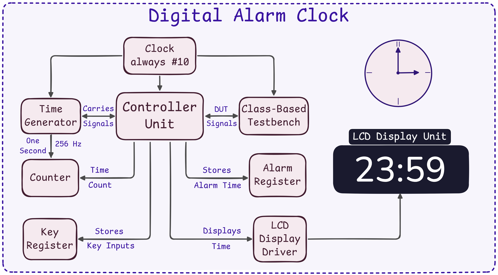
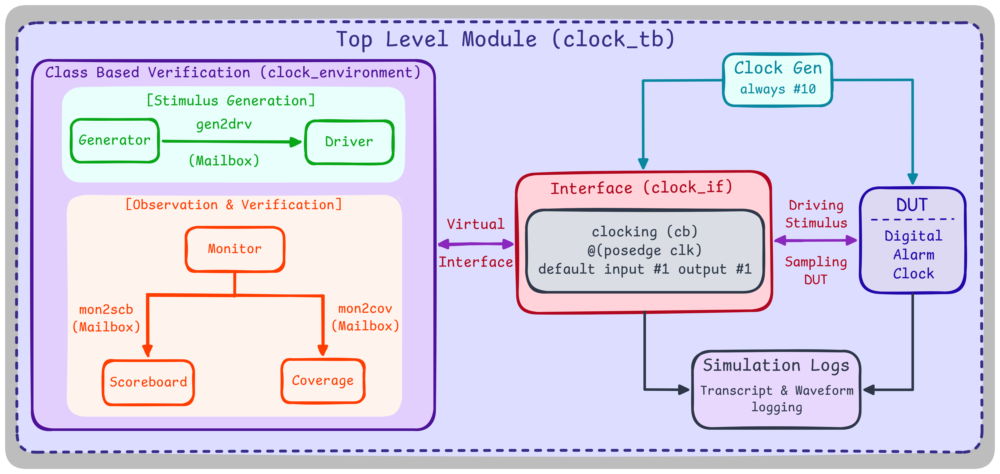

# Digital Alarm Clock
 
**Status: Work in progress — the design is fully functional and simulates end-to-end, but the testbench itself still has known bugs I'm actively fixing on other branches.**
 
A digital alarm clock built in SystemVerilog RTL, verified with a class-based, transaction-oriented testbench (driver / monitor / scoreboard / coverage collector, all connected through mailboxes — basically a UVM-style environment without pulling in the UVM library).
 
I'm making this public now because the design itself is done and runs, even though verification is still catching up. If you look at the coverage log and see failures, that's expected right now — see [Known Issues](#known-issues-in-the-testbench) below.
 
---
 
## Architecture
 

 
The design is a `controller_unit` that wires together a small set of sub-modules:
 
| Module | Role |
|---|---|
| `[controller_unit.sv](rtl/controller_unit.sv)` | Top-level FSM — debounces the buttons, sequences the 4-digit key-entry cycle, and routes data between the other blocks |
| `[key_reg.sv](rtl/key_reg.sv)` | Shifts in 4-bit key presses into a buffer as the user enters a new time/alarm value |
| `[counter.sv](rtl/counter.sv)` | Holds and increments the current time (hours/minutes) |
| `[alarm_register.sv](rtl/alarm_register.sv)` | Holds the programmed alarm time |
| `[time_generator.sv](rtl/time_generator.sv)` | Generates the one-second / one-minute tick, with a fast-forward mode for simulation |
| `[lcd_display_unit.sv](rtl/lcd_display_unit.sv)` / `[lcd_display_driver.sv](rtl/lcd_display_driver.sv)` | Decides what to show on the display (current time, alarm time, or the value being entered) and drives the output |
 
### How entry works
 
Pressing the **time button** or **alarm button** kicks off a 5-cycle window where `key_reg` shifts in a new 4-digit value one nibble at a time. On the last cycle, the buffered digits are loaded into either the current-time counter or the alarm register, and the display switches back to normal. `fast_watch` speeds up the minute tick for testing without waiting real-time.
 
---
 
## Verification
 

 
The testbench is transaction-oriented and class-based:
 
- **`[clock_item](testbench/clock_item.sv)`** — the transaction: reset, button presses, key value, fast-watch flag
- **`[clock_generator](testbench/clock_generator.sv)`** — randomizes transactions
- **`[clock_driver](testbench/clock_driver.sv)`** — drives them onto the DUT via a virtual interface (`clock_if`)
- **`[clock_monitor](testbench/clock_monitor.sv)`** — samples DUT inputs/outputs and packages them as observed transactions
- **`[clock_scoreboard](testbench/clock_scoreboard.sv)`** — reimplements the expected time/alarm behavior and checks it against what the monitor saw
- **`[clock_coverage](testbench/clock_coverage.sv)`** — functional coverage (reset, fast-watch, button presses, key values)
- **`[clock_environment](testbench/clock_environment.sv)`** — wires the above together with mailboxes
- **`[clock_tb](testbench/clock_tb.sv)`** — the top-level module that instantiates the DUT and the environment
### Running it
 
Simulation is set up for **Questa/ModelSim**. From the `sim/` directory:
 
```bash
python run.py
```
 
This compiles everything listed in `files.f`, elaborates `clock_tb`, and runs the simulation with a random seed, dumping a VCD (`waves.vcd`) and appending the transcript to `simulation_history.log`.
 
---
 
## Known issues in the testbench
 
The RTL itself works — these are testbench-side gaps I'm actively fixing on separate branches:
 
1. Time-flip-over (e.g. 23:59 → 00:00) isn't correctly modeled yet, which causes some scoreboard mismatches.
2. The alarm button path isn't fully covered by the testbench yet.
3. The 4-key entry cycle is a bit too short for the driver to reliably push randomized keys through in time, causing occasional dropped/misaligned key writes.
4. Functional coverage is incomplete — currently around 50%, with the time-button and alarm-button coverage bins not yet hit.
Current run (see docs/coverage.txt): 1500 passed, 0 failed. Coverage hit the reset and fast-watch bins but not the time/alarm button bins yet — that's the main gap left to close.
 
---
 
## Repo layout
 
| Folder | Contents |
|---|---|
| [`rtl/`](rtl/) | Synthesizable design |
| [`testbench/`](testbench/) | Class-based verification environment |
| [`sim/`](sim/) | Run script + file list for Questa/ModelSim |
| [`docs/`](docs/) | Block diagrams, coverage log |
 
---
 
## Why I'm building this
 
The RTL was built from scratch by me off a spec sheet — no reference implementation, just working out the design and the FSM logic myself.
 
The verification side is a self-directed exercise on top of that: the goal is to practice writing a proper transaction-level, mailbox-connected testbench (the kind of structure UVM formalizes) without leaning on the UVM library itself, so I actually understand what's happening underneath it.
 
Feedback and issues are always welcome — this is very much a live project.